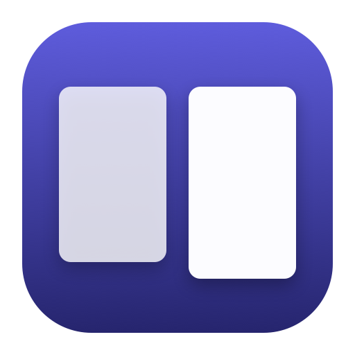

<div align="center">
  
  <h1>two-up-viewer</h1>
  <p><strong>A macOS comic and manga reader for folders of page images.</strong><br>
  Native AppKit and SwiftUI. No network access, no accounts, no telemetry.<br>
  it opens a folder on your disk and reads it.</p>
  <p>
    <a href="#features">Features</a> ·
    <a href="#usage">Usage</a> ·
    <a href="#build">Build</a> ·
    <a href="#contributing">Contributing</a> ·
    <a href="#license">MIT License</a>
  </p>
</div>

## Features

- **Opens a folder of page images** — `.jpg`, `.jpeg`, `.png`, `.webp`, `.gif`,
  `.bmp`, `.tiff`, `.tif`, `.heic`, `.heif`, `.avif`.
- **Two-up and single-page layouts**, left-to-right or right-to-left.
- **Two ways to read.** Continuous scroll through the volume, or one spread at
  a time.
- **Zoom that holds still** — fit page, fit width, actual size, or a percentage
  you type, all kept as you turn.
- **Page strip** with thumbnails that load as they appear. Click a page to jump,
  ⌃S to hide the strip.
- **Natural order** wherever numbers are involved — `page 2` before `page 10`,
  and `vol 2` before `vol 10` in the volume picker.
- **Go to page** (⌘G), plus Home and End for the ends of the volume.

## Usage

Launch it and drop a volume folder onto the welcome window. The folder has to be
the one that holds the page images, not its parent.

Volumes that sit side by side are listed at the top of the page strip — click the
volume name to switch, and each row carries its page count. Hiding the strip
hides the picker with it.

Click the canvas to go to the next page and right-click to go back.

### Shortcut Keys

| | |
|---|---|
| `←` `→` `↑` `↓` | Previous / next page |
| `Page Up` / `Page Down` | Previous / next page |
| `Home` / `End` | First / last page |
| `⌘O` | Open folder |
| `⌘G` | Go to page |
| `⌃S` | Show or hide the page strip |
| `⌥⌘↑` / `⌥⌘↓` | Previous / next volume |
| `⌘0` | Actual size (100%) |
| `⌘+` / `⌘=` / `⌘-` | Zoom in / out |

The zoom control in the toolbar also takes a typed percentage and a slider on a
log scale.

## Requirements

- macOS 13 or later
- Swift 5.9 or later to build (Xcode 15 or later)

## Build

```sh
git clone https://github.com/badjeff/two-up-viewer.git   # or your fork
cd two-up-viewer
./build-app.sh
```

That produces `build/two-up-viewer.app`.

GitHub Actions builds the same bundle on every push to `main` and attaches the
zipped `.app` to the run.

`build-app.sh` takes an optional configuration argument — `./build-app.sh
debug` for a debug build; release is the default. Add `--quick` for a debug
build of this machine's architecture only, reusing the rendered icon, when you
want a bundle to click through in about two seconds. It is not shippable.

`swift build` on its own also works and produces a runnable binary. The
Mach-O carries an embedded `Info.plist`, so it behaves like a bundled app
(Dock icon, menu bar) before the script wraps it in a real `.app` with an
on-disk plist and an ad-hoc signature.

`Tools/make-icon.swift` draws the app icon, so the `.icns` is generated rather
than checked in as binary artwork. `docs/icon.png` is the one committed image —
it is what this README shows.

## Contributing

This is a vibe-coded project. It was built by feel, for personal use, with no
plan behind the structure and no time to defuse the slop grenades — code that
works but should not be there, and bugs that are known and still open. Don't
spend a pass on those unless you are asked to.

Two things still hold: `swift build` stays warning-clean, and the reasoning
behind a non-obvious decision goes in the *Traps that are not obvious from the
code* section of [AGENTS.md](AGENTS.md) rather than in a comment.

## License

MIT. See [LICENSE](LICENSE).
